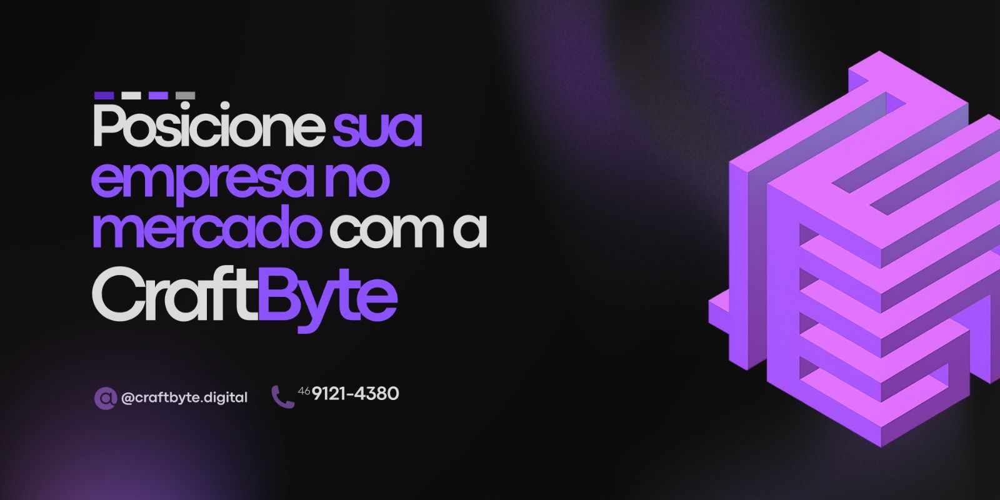

  

  

---

<table>
  <tr>
    <td width="60%" valign="top">
      <h1>💫 About Me</h1>
      

        Hi 👋, I'm <b>Julho Vanzella</b>!  
        Sou um <b>Desenvolvedor Full-Stack</b> brasileiro focado em transformar ideias em experiências digitais de alto impacto através da <b>CraftByte</b>. Atualmente, divido meu tempo entre a engenharia de software e o estudo profundo de <b>Malware Analysis</b> e <b>Cybersecurity</b>.
      

      

        📫 <b>Contact:</b> <a href="mailto:julhoeduardo7@gmail.com">julhoeduardo7@gmail.com</a> 
        🌐 <b>Portfolio:</b> <a href="https://craftbyte-site.vercel.app">craftbyte-site.vercel.app</a>
      

      

         
        
      

    </td>
    <td width="40%" align="center">
      
    </td>
  </tr>
</table>

---

## 💻 Tech Stack

### 🚀 Frontend & Design
     

### ⚙️ Backend & Tools
    

---

<h2 align="center">🎯 Cᴜʀʀᴇɴᴛ Fᴏᴄᴜs</h2>

<table>
  <tr>
    <td width="33%" valign="top">
      <h3 align="center">📚 Learning</h3>
      <ul>
        <li>🔐 Malware Analysis (Reverse Engineering)</li>
        <li>🛡️ Red Team Ops</li>
        <li>⚡ Advanced Next.js Patterns</li>
      </ul>
    </td>
    <td width="33%" valign="top">
      <h3 align="center">🚀 Projects</h3>
      <ul>
        <li>🏗️ <b>CraftByte</b> Agency Growth</li>
        <li>🧬 Malware Lab Experiments</li>
        <li>🎮 Interactive 3D Web Experiences</li>
      </ul>
    </td>
    <td width="33%" valign="top">
      <h3 align="center">✨ Goals 2026</h3>
      <ul>
        <li>🏢 Expand international client base</li>
        <li>🎓 Obtain Cybersec Certifications</li>
        <li>🛠️ Open Source Security Tools</li>
      </ul>
    </td>
  </tr>
</table>

---

<h2 align="center">📈 Cᴏɴᴛʀɪʙᴜᴛɪᴏɴ Gʀᴀᴘʜ</h2>

  

---

  

  

