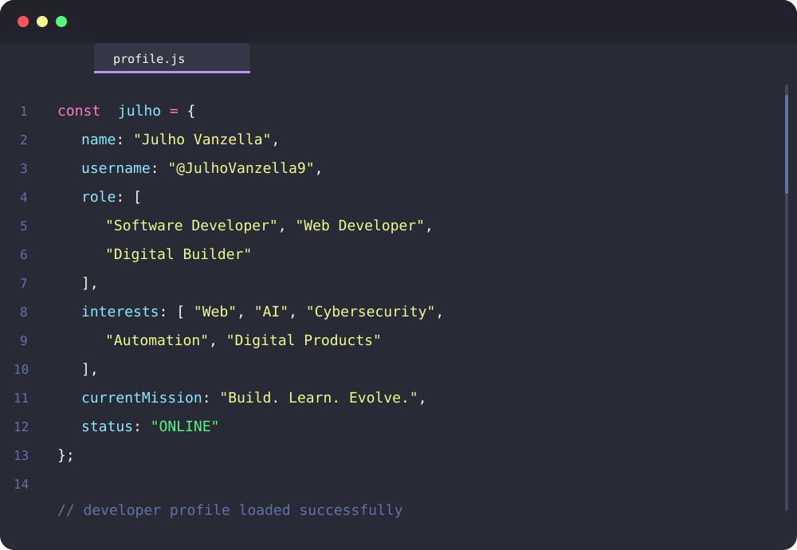
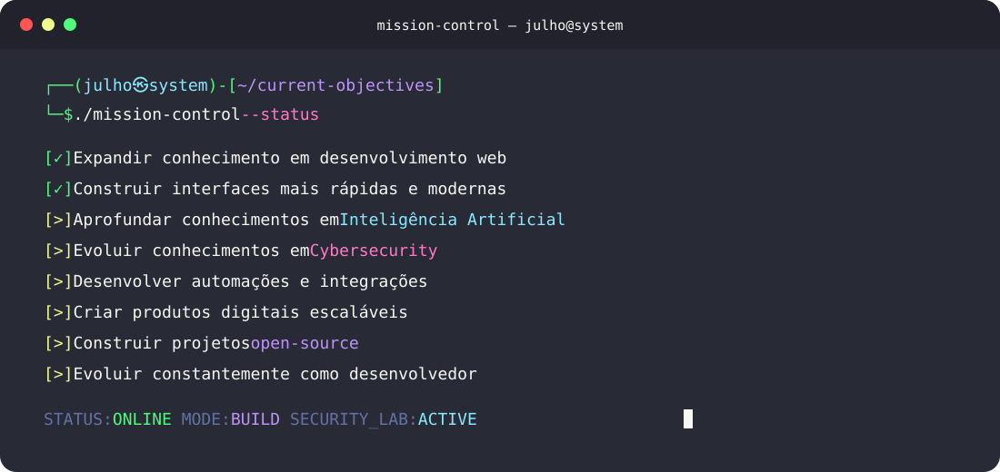

<!-- JULHO VANZELLA // GITHUB PROFILE -->

  

  

---

## `[ 01 ] // USER_IDENTITY`

<table>
<tr>
<td width="68%" valign="middle">

</td>
<td width="32%" align="center" valign="middle">

 
<b>JULHO VANZELLA</b> 
FULL-STACK DEVELOPER // CYBERSECURITY

</td>
</tr>
</table>

---

## `[ 02 ] // TECHNOLOGY_MATRIX`

### 🧠 Languages & Scripting

  

### 🚀 Frontend & Design

  

### ⚙️ Backend, APIs & Data

 

---

## `[ 03 ] // TOOLKIT`

 

 

---

## `[ 04 ] // PROJECT_DATABASE`

<table>
<tr>
<td width="33%" valign="top">

### ⚡ Lumo Digital

Soluções web, landing pages, interfaces modernas e produtos digitais focados em performance e conversão.

`Web` `UI/UX` `Digital Products`

</td>
<td width="33%" valign="top">

### 🧬 Malware Lab

Ambiente de estudo voltado para malware analysis, reverse engineering e fundamentos de segurança ofensiva.

`Cybersecurity` `Reverse Engineering` `Research`

</td>
<td width="33%" valign="top">

### 🌐 Interactive Web

Experimentos com experiências digitais interativas, interfaces avançadas e aplicações modernas.

`React` `Next.js` `Three.js`

</td>
</tr>
</table>

---

## `[ 05 ] // ACTIVE_MISSIONS`

  

---

## `[ 06 ] // CONTRIBUTION_SNAKE`

  <picture>
    <source media="(prefers-color-scheme: dark)" srcset="https://raw.githubusercontent.com/JulhoVanzella9/JulhoVanzella9/output/github-contribution-grid-snake-dark.svg">
    <source media="(prefers-color-scheme: light)" srcset="https://raw.githubusercontent.com/JulhoVanzella9/JulhoVanzella9/output/github-contribution-grid-snake.svg">
    
  </picture>

 

  

